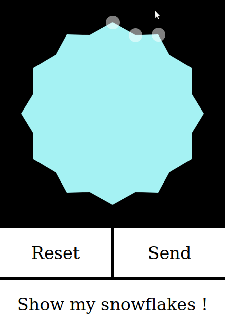

# The special snowflake

_What is a blizzard but a multitude of snowflakes?_

Collection of three minimalist pieces of software that can be used together to implement a simple multi-user game, in which users create custom snowflakes using their mobile phone browser. Once saved to the server, their snowflake is added to a virtual "blizzard", composed of all the snowflakes ever created by all users. This blizzard is displayed in a nice way, showing that despite the snowflakes being all identical at the first look, each one is unique.

To further highlight this, the user is able, on request, to temporarily highlight in the blizzard all the snowflakes he designed.

# Components
All components are built and maintained using npm only: no other package manager or task runner. 

## SnowApp
Mobile-first single page web page that allows the user to create custom snowflakes dragging some dots. Five dots already provides an great diversity of possible looks. For now, the amount of spikes is fixed to 6,

Using jQuery and jQuery-ui's draggable function. Those dependencies could be dropped easily.

## SnowRenderer
Minimalist full screen web page, rendering of a snow tempest.

Using THREE.js WebGL capabilities for the rendering, and a home-brewed minimal WebSocket library for the communication with the server. 

## SnowServer
Minimalist back-end in Node.JS, relaying the messages from the WebApp to the Renderer, and providing a way for the Renderer to save its whole state. 

This way the SnowRenderer and the SnowServer interacts (this simple real-time message passing channel, augmented by this "save full state" functionality) is inherited from the way the whole Pimp-My-Wall system was working. If used in stand-alone, it should probably be reworked in a way the SnowServer is not more agnostic anymore about the state's contents. 
